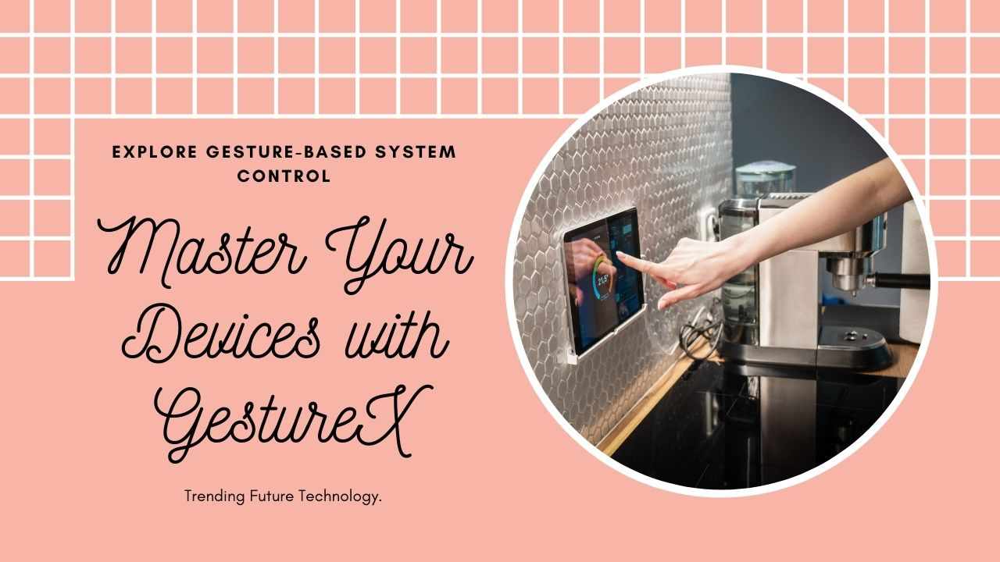

# GestureX: Intuitive Hand Gesture Control System

GestureX unleashes the power of hand gestures to control your computing experience with unparalleled ease and precision. Leveraging the advanced capabilities of OpenCV, this innovation offers a seamless interface between human motion and digital response, essentially transforming your mere hand movements into a commanding tool for computer navigation and control.



## Project Overview

At the core of GestureX lies a highly responsive hand-tracking module that harnesses computer vision technologies to interpret physical hand gestures, providing a natural and intuitive user interface. With a simple wave of a hand, users can perform a multitude of tasks without the need for traditional input devices like a mouse or keyboard.

### Key Features

- **Precise Hand Tracking:** Utilizes `HandTrackingModule.py` for accurate tracking of hand landmarks.
- **Gesture Recognition:** Interprets various hand gestures to perform tasks using `gestureX.py`.
- **Real-Time Responsiveness:** Achieves high frames-per-second (FPS) rate for a fluid user experience.
- **Accessibility:** Requires no specialized hardware, making it accessible for a broader audience.
- **Multifunctional Controls:** Offers a range of control options from simple cursor movements to complex commands like opening drives or applications.

## Technologies Used

GestureX is built with a stack centered around Python and OpenCV, ensuring a robust and scalable solution.

- [Python](https://www.python.org)
- [OpenCV](https://opencv.org/)
- [MediaPipe](https://mediapipe.dev/)
- [NumPy](https://numpy.org/)
- [AutoPy](https://autopy.org/)
- [PyCharm IDE](https://www.jetbrains.com/pycharm/)

## Getting Started

To get started with GestureX, ensure you have the following prerequisites installed on your system:

- Python 3.x
- OpenCV library
- MediaPipe
- NumPy
- AutoPy

Once the prerequisites are installed, clone the repository to your local machine and navigate to the project directory.

```bash
git clone https://github.com/yourusername/GestureX.git
cd GestureX
```
Run gestureX.py to start the hand gesture control system.
```bash
python gestureX.py
```
## Documentation 

For detailed understanding, here's a brief on the main modules:

  - HandTrackingModule.py: This module is central to the project, incorporating Mediapipe and OpenCV to track hand landmarks in real-time and provide necessary coordinates for gesture recognition.
  - gestureX.py: Built upon the HandTracking module, it interprets the hand landmarks to perform various control actions like mouse movement, clicks, and executing system commands.

## Contributions and Support
Your contributions are welcome! If you would like to contribute, fork the repository, make changes, and create a pull request with your improvements. For any support or queries, raise an issue in the GitHub issue tracker.
## License
This project is licensed under the MIT License - see the [LICENSE](LICENSE) file for details.

## Acknowledgments
Special thanks to all the contributors and open-source libraries that made this project possible.

